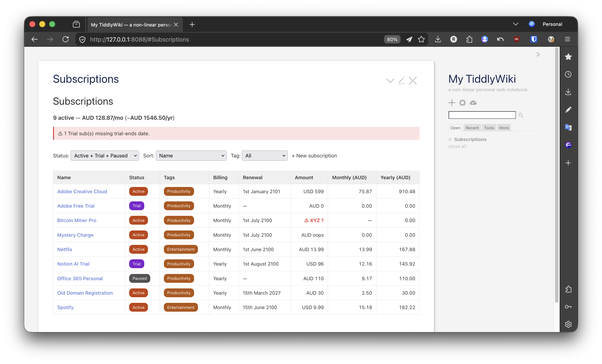
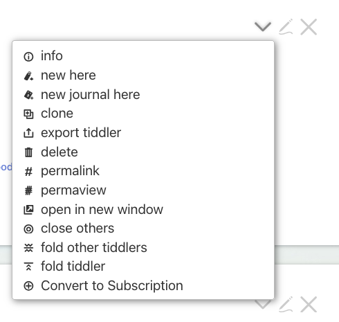
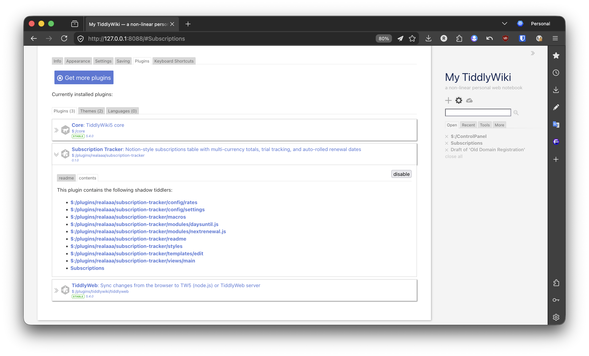

# Subscription Tracker for TiddlyWiki

A vanilla TiddlyWiki 5.4+ plugin that turns `subscriptions`-tagged tiddlers into a Notion-style table with multi-currency monthly + yearly cost math, trial countdowns, render-time auto-rolled renewal dates, and a structured editor.

**Plugin id:** `$:/plugins/realaaa/subscription-tracker` · **License:** MIT · **Current version:** 0.1.11



## Features

- **Notion-style table** with status pills (Active / Trial / Paused / Canceled), category-tag pills, billing-frequency, renewal date, native amount, monthly equivalent, yearly equivalent.
- **Multi-currency.** Each subscription stores its native currency. Monthly / yearly columns and totals convert to a single configurable display currency via a user-maintained rates tiddler.
- **Render-time auto-roll** for renewal dates: if the stored `renewal-date` is in the past for an Active/Trial/Paused sub, the displayed date rolls forward by `billing-frequency` chunks until it's in the future. The stored field is never mutated, so `git diff` stays clean.
- **Trial countdown** via a `trial-ends` field, separately from `renewal-date`.
- **Structured EditTemplate.** Tiddlers tagged with `subscriptions` get a labeled form (status / billing / amount / currency / dates / URLs / payment hint) instead of TW's default field editor.
- **+ New subscription** button on the main view.
- **Filter dropdowns:** status (Active+Trial+Paused / All / Active / Trial / Paused / Canceled) and category-tag.
- **Sort dropdown:** Name, Next renewal, Monthly cost (high→low), Yearly cost (high→low).
- **Strict data hygiene.** Missing currency rate, missing trial-ends on a Trial sub, or display-currency misconfiguration each surface as a banner above the table with a counter — failing visibly rather than silently lying about totals.
- **No external plugin dependencies.** Two small in-plugin JS filter modules cover the date arithmetic that TW 5.4 core lacks; everything else is pure WikiText + CSS.

## Install

The plugin can be installed two ways depending on how you run TiddlyWiki.

### A) Single-file drop-in (any TiddlyWiki 5.4+ wiki)

Download [`subscription-tracker-0.1.11.json`](https://github.com/realaaa/tiddlywiki-subscription-tracker/releases/download/v0.1.11/subscription-tracker-0.1.11.json) (newer versions on the [releases page](https://github.com/realaaa/tiddlywiki-subscription-tracker/releases)) and drag it onto your wiki's import area. Save the wiki. The shadow tiddler `Subscriptions` becomes available immediately — open it via direct URL fragment `#Subscriptions`, the top search box, or the sidebar's **More → Shadows** tab.

### B) Node.js install (separate-tiddler-files mode)

If your wiki runs on `tiddlywiki` from npm with a folder of `.tid` files:

1. Clone or copy this repo somewhere accessible. The plugin folder is `plugins/realaaa/subscription-tracker/`.
2. Pick one of the two install shapes below.

   **Option 1 — `TIDDLYWIKI_PLUGIN_PATH` (keeps the `realaaa/` publisher folder)**

   Point TW at the repo's `plugins/` directory at launch:
   ```sh
   TIDDLYWIKI_PLUGIN_PATH=/path/to/this/repo/plugins tiddlywiki /your-wiki --listen
   ```
   Then add the plugin to your wiki's `tiddlywiki.info` `plugins` array:
   ```json
   {
     "plugins": [
       "tiddlywiki/filesystem",
       "tiddlywiki/tiddlyweb",
       "realaaa/subscription-tracker"
     ]
   }
   ```
   The env var supplies the search path; the info file says which plugin to load.

   **Option 2 — drop into your wiki's local `plugins/` folder (flat, no env var)**

   The wiki's own `plugins/` folder is flat — each immediate subdirectory is loaded as a plugin directly. So copy or symlink the **inner** `subscription-tracker/` folder, **not** the `realaaa/` publisher folder:
   ```sh
   cp -R /path/to/this/repo/plugins/realaaa/subscription-tracker /your-wiki/plugins/subscription-tracker
   # or: ln -s /path/to/this/repo/plugins/realaaa/subscription-tracker /your-wiki/plugins/subscription-tracker
   ```
   Plugins under the wiki's local `plugins/` folder load automatically — do **not** add `realaaa/subscription-tracker` to the `tiddlywiki.info` `plugins` array, or TW will also try to resolve it via the search path and warn `Cannot find plugin`.
3. Restart your wiki.

## Use

1. **Open the `Subscriptions` view.** Direct URL `#Subscriptions`, top search box, or sidebar **More → Shadows**.
2. **Add subscriptions.** Click **+ New subscription** on the view, or tag any tiddler with `subscriptions` plus 1+ category tag (`Entertainment`, `Productivity`, etc.). The custom edit form appears whenever you edit a `subscriptions`-tagged tiddler.
3. **Required fields per subscription:** `status`, `billing-frequency`, `amount`, `currency`, plus `renewal-date` for non-Canceled subs and `trial-ends` for Trial subs.


### Convert an existing tiddler to a subscription

If you already have a tiddler for a vendor (e.g. an existing `Netflix` or `Spotify` note with body content, links, history) and want to start tracking it as a subscription without losing the body or other fields, the plugin ships a **Convert to Subscription** action. It lives in the tiddler's overflow dropdown so it doesn't clutter the main toolbar of every tiddler in your wiki.

1. Open the tiddler you want to convert (e.g. `Netflix`).
2. Click the down-arrow **▾** icon in the tiddler's toolbar (TiddlyWiki's standard "more actions" dropdown — usually next to the edit and close icons).
3. Click **Convert to Subscription** in the dropdown. The plugin will:
   - append the configured tag (default `subscriptions`) to the tiddler's existing tags,
   - set `status=Active`, `billing-frequency=Monthly`, `currency=<your display currency>`, `renewal-date=today + 30 days`,
   - create empty placeholder fields (`amount`, `trial-ends`, `vendor-url`, `cancel-url`, `payment-method`) only if they don't already exist on the tiddler (so any pre-existing values are preserved),
   - open the tiddler in edit mode so you can fill in `amount` and adjust the other defaults.

The action only appears in the dropdown for tiddlers that are not already subscriptions and not system tiddlers — once a tiddler is converted, the entry disappears from its dropdown automatically.

**Tip — pin to main toolbar for bulk onboarding.** If you have many tiddlers to convert in one session, you can promote the action from the dropdown to the main view toolbar: open any tiddler's info area (click the **i**-circle), switch to the **Tools** tab, find the **Convert to Subscription** row, and check its checkbox. To put it back in the dropdown, uncheck the row.



## Configure

- **`$:/plugins/realaaa/subscription-tracker/config/settings`** — display currency (default AUD), tag-name (default `subscriptions`), renewal-soon threshold in days (default 14), show-canceled-default (default `no`).
- **`$:/plugins/realaaa/subscription-tracker/config/rates`** — JSON map of currency rates relative to the display currency. Ships with `AUD: 1.0, USD: 1.52, EUR: 1.65, GBP: 1.92`. Update when rates drift; the display-currency entry must always be `1.0`.

## Roadmap

- **v0.2** — proper monthly/yearly-cost sort that normalises across billing-frequency, display-currency toggle UI, dedicated "no subscriptions yet" empty state.
- **v0.3** — lifetime / historical spend (`started-date` field).
- **v0.4** — family / shared subs (`shared-with` field, effective-cost split).
- **v0.5** — TiddlyTools/Time/Alarms integration for actual reminder notifications.

## Develop

The repo is a TiddlyWiki plugin source tree plus tests:

```
plugins/realaaa/subscription-tracker/   plugin source
tests/wiki/                             bare TW node wiki for testing
tests/render/                           render-test fixtures + expectations.txt
tests/fixtures/                         manual end-to-end fixture set
tests/test-plan.md                      12-scenario manual test
bin/run-render-tests.sh                 fixture-based render runner (39 tests)
bin/test-build.sh                       plugin-packaging smoke
assets/                                 README screenshots
```

To work on the plugin:

```bash
# Run the wiki for browser testing
cp tests/fixtures/*.tid tests/wiki/tiddlers/
TIDDLYWIKI_PLUGIN_PATH=$(pwd)/plugins tiddlywiki tests/wiki --listen host=127.0.0.1 port=8088
# Open http://127.0.0.1:8088/#Subscriptions

# Run render tests after edits
bin/run-render-tests.sh

# Smoke test the plugin builds cleanly
bin/test-build.sh

# Rebuild dist JSON (drag-drop import bundle: a 1-element array containing
# the plugin tiddler, with the inner shadow tiddlers stringified into its
# `text` field — this is the shape TW's import accepts).
TIDDLYWIKI_PLUGIN_PATH=$(pwd)/plugins tiddlywiki tests/wiki \
    --output dist \
    --rendertiddler '$:/core/templates/exporters/JsonFile' subscription-tracker-0.1.11.json application/json "" exportFilter '[[$:/plugins/realaaa/subscription-tracker]]'
```

If render tests behave weirdly, check `tests/wiki/tiddlers/` for stale fixture leftovers from interrupted runs and clean them:

```bash
find tests/wiki/tiddlers/ -name "*.tid" -not -name '$__StoryList.tid' -delete
```

The plugin ships as a set of shadow tiddlers under `$:/plugins/realaaa/subscription-tracker/`:



## Credits

- Inspiration: the [TiddlyWiki forum thread on subscription tracking](https://talk.tiddlywiki.org/t/subscriptions-tracker-in-tiddlywiki/12631) (Sunny, Springer, Eric Shulman).
- Notion-style table layout as the design target.
